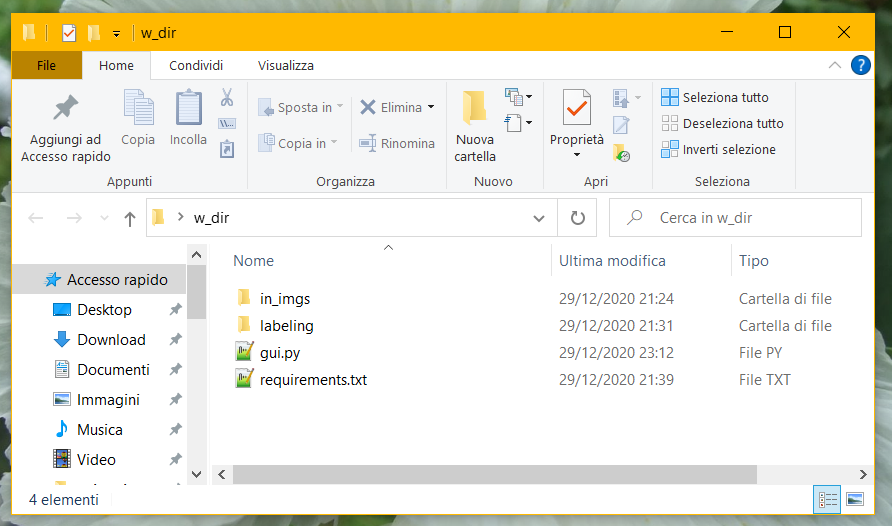
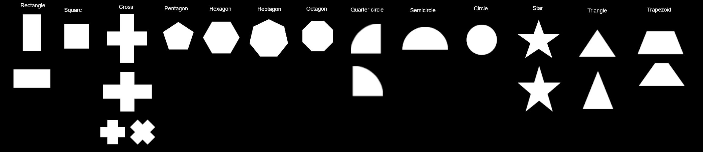

# Labeling GUI

Based on a work by the Sapienza Flight Team in 2019.

---

### Description

Our dataset is composed of photos taken from a terrace about 30
meters high, with **geometric shapes** made on cardboard on the floor.

Our goal is to provide *labels* for each image in our dataset,
to feed a script which will add **synthetic alphanumeric characters**
on the shapes, to produce images which in turn will feed a Machine
Learning Model.

The labels consist of: shape name, shape color, bounding box, rotation.

The script provides a GUI for easily inserting al kinds of labels.
You can *zoom* to select a portion of the image and better see the
shapes, crop and rotate the shape to find bounding box and rotation,
and select shape name and color from a drop-down list.

[On YouTube](https://youtu.be/D5o2BuDhtRc) you can find a brief "tutorial"
where I explain how to use this GUI.

---

### Installation and usage:
(you can also use [Anaconda](https://www.anaconda.com/products/individual#Downloads)
instead of pip and virtualenv)

1. install Python: you can find the last release [here](https://www.python.org/downloads/),
   but the program was tested on [Python 3.6](https://www.python.org/downloads/release/python-3612/),
   which can be installed following [this tutorial](https://www.pytorials.com/python-download-install-windows/)
   with links to 32 and 64 bit installers, while [here](https://www.python.org/downloads/release/python-387/)
   there is a more recent release (Python 3.8)
    \
   **in the installer, make sure "Add Python 3.x to PATH" option is checked;**
2. open your prompt/cmd (on Windows) or terminal/bash (on macOS or Linux) and go to
   your working directory, where there are the script `gui.py`,
   the file `requirements.txt` and the folder with the input images (let's call it `in_imgs`),
   let `w_dir` be its path:
   ```
   cd w_dir
   ```
   if the path contains any space, it has to be enclosed in quotes;
3. install pip:
   ```
   python3 -m pip install --user --upgrade pip   # or
   python -m pip install --user --upgrade pip
   ```
4. create a virtual environment called `labeling`:
   ```
   python3 -m venv labeling   # or
   python -m venv labeling
   ```
   the content of your working directory will something be:
   ```
   - in_imgs
   - labeling
   - gui.py
   - requirements.txt
   ```
   
5. activate the virtual environment:
   ```
   .\labeling\Scripts\activate    # on Windows or
   source labeling/bin/activate   # on macOS/Linux
   ```
6. install the requirements:
   ```
   pip install -r requirements.txt             # or
   python -m pip install -r requirements.txt   # or
   python3 -m pip install -r requirements.txt
   ```
   on Windows, it may be necessary to install the Microsoft C++ Build Tools from
   [here](https://visualstudio.microsoft.com/it/visual-cpp-build-tools/), to make
   the requirements installation work, so pay attention to what is written in the
   prompt/cmd;
7. execute the script:
   ```
   python gui.py -dir ./in_imgs -save results/results.tsv
   ```
   recall that `in_imgs` must be the name of the directory which
   contains the input imagges;
8. submit all the shapes in the images you work on;
9. leave the virtual environment:
   ```
   .\labeling\Scripts\deactivate
   ```

---

### Notes

Once you installed everything, if you want to resume your work, it is
sufficient to repeat the steps 2, 5, 7, 8, 9.

If you want to continue your labeling work in a different moment, the
script will resume directly from the next picture with respect to the
last one from which you submitted some labels, so, remember to **fill
the labels for all the shapes in a photo** before quitting.

For this task, the most important thing is **crop**, which needs to be as
precise as possible. The *rotation preview* is for the sole purpose of
helping to select the rotation value, but it isn't so bad if it
becomes ruined after rotation (e.g., some vertices of the shape are cut off).

**Blurry images** still need labeling, until the shape and color are
recognizable. **Partial shapes** (targets on the boudary of the image) can
be ignored; if a picture contains only partial shapes, it can be considered
empty. For **empty images** (without any target) use the button `empty`.

You can use the `esc` key to quit (undo) from the zoom/regions dialogue
and `enter` to confirm the selection.

You can use the `tab` key to move across fields, to fill them faster,
and `up/down arrows` to increment/decrement the rotation.

If the *ROI selector window* doesn't close or keeps reopening, you can
just close the prompt/terminal when you have finished.

Rotated shapes should look like the ones in the following picture:
the circle can have any rotation, the square can be aligned to any one
of its sides, and so on.
 \
(click to see better)

---

### Shortcuts:
- ctrl+M: select shape regions
- ctrl+Left: previous image
- ctrl+Right: next image
- ctrl+S: submit
- ctrl+R: rotate 90 degrees
- ctrl+W: close window
- esc: close zoom/regions dialogue

---

### Troubleshooting:

-  If you get some errors while installing the requirements (step 6), my
   advice is to try with Python 3.6, instead of using the last version
   (run `deactivate`, delete the environment directory `labeling` and restart from step 1).
   You can find some link to installers and tutorials in step 1.
   
   If you already use Python, you can install another version _without_
   adding it to the PATH, and use it when you create your environment.
   Instead of step 4, run:
   ```
   python3 -m pip install --user virtualenv      # or
   python -m pip install --user virtualenv
   
   virtualenv -p <path to python3.6> labeling
   ```
   Recall that if the path contains any space, it has to be enclosed in quotes.
   Then continue from step 5. If the command `virtualenv` isn't recognizet,
   you may have to close and reopen your cmd/terminal (in this case, remember
   to repeat step 2).

-  If you're on a Mac, and the gui crashes when launched, if you read
   "You might be loading two sets of Qt binaries into the same process"
   in the terminal, try the following:
   ```
   pip uninstall opencv-python
   pip install opencv-python-headless
   ```
   Then just save and run the script again (step 7).

-  If you can't see the buttons, which should be at the bottom of the image,
   you can try to enlarge the window. If it doesn't work, you can open the
   script `gui.py` with a text editor (e.g. Notepad, Gedit, TextEdit...) and
   replace the rows n. 37, 38
   ```
   self.width = 1200  # 640
   self.height = 900  # 480
   ```
   with the following:
   ```
   self.width = 1000
   self.height = 750
   ```
   Then just save and run the script again (step 7).
